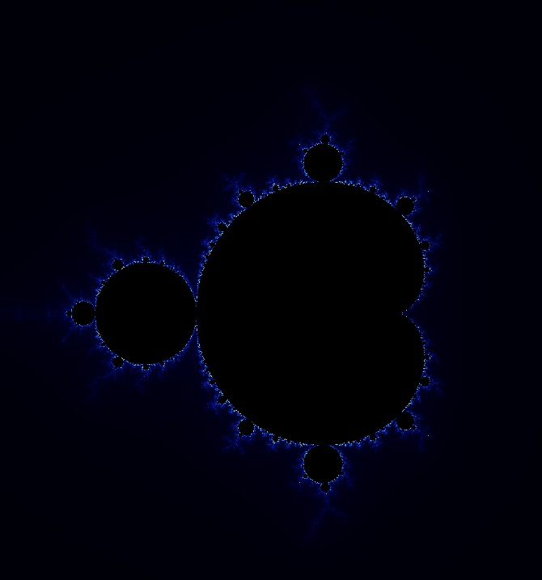

# Mandelbrot Set Renderer 

A high-performance Mandelbrot set visualizer written in C using SDL2.  
This project demonstrates real-time fractal rendering with customizable zoom, pan, and iteration depth.  
It serves as both a mathematical exploration tool and an example of low-level graphics programming.

## Features
- **SDL2-based rendering** for smooth graphics output.
- **Adjustable zoom & pan** to explore fractal details.
- **Configurable max iterations** for different levels of detail.
- **Compact & efficient code** written in C for performance.

## Screenshot
  
Actual visualizer generated plot


## Prerequisites
- **C compiler** (GCC/Clang recommended)
- **SDL2 library** installed on your system

### On Ubuntu/Debian
```bash
sudo apt install libsdl2-dev
```

**Build the project**:
   ```bash
   make run
   ```
